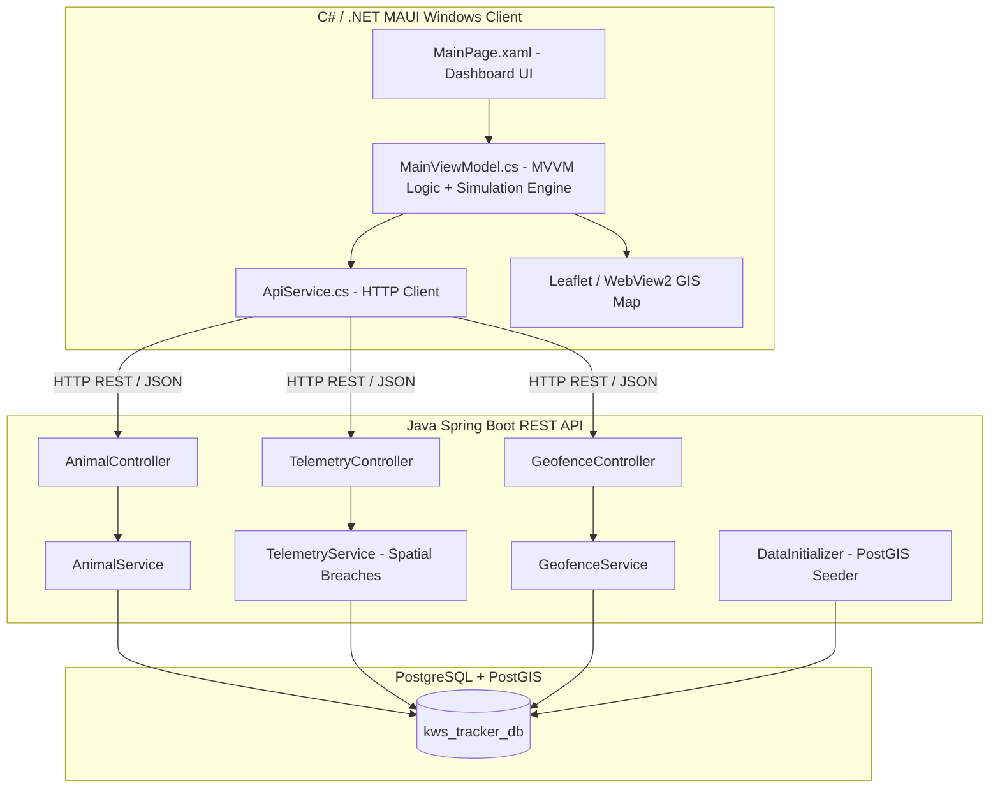

# 🐾 WildGuard Tracker — Kenya Wildlife Service Operations Command

[](https://dotnet.microsoft.com/en-us/apps/maui)
[](https://spring.io/projects/spring-boot)
[](https://postgis.net/)
[](https://locationtech.github.io/jts/)

**WildGuard Tracker** is an enterprise spatial monitoring and dispatch dashboard engineered for the **Kenya Wildlife Service (KWS)**. It provides field commanders, dispatchers, and rangers with real-time collar telemetry tracking, PostGIS-powered geofence monitoring, early-warning Human-Wildlife Conflict (HWC) breach alerts, and rapid-response patrol coordination across Kenya's flagship national parks and conservancies.

---

## 🌍 Monitored Kenyan Ecosystems

| Sector / Park | Ecosystem & County | Target Species | Key Operational Mission |
| :--- | :--- | :--- | :--- |
| **Amboseli National Park** | Kajiado / Mt. Kilimanjaro Basin | African Elephants (*Loxodonta africana*) | Monitoring herds (*Echo's Matriarch*, *Mutula Bull*) along the southern Kimana community agricultural buffer corridor. |
| **Tsavo East & West National Parks** | Taita-Taveta / Galana River | Red Elephants, Lions (*Panthera leo*) | Vast wilderness tracking (*Galana Red Bull*, *Satao Pride*) across Voi dispersal corridors and SGR crossings. |
| **Maasai Mara National Reserve** | Narok / Mara River Basin | Apex Predators (Lions, Cheetahs) | Mara Predator Project (*Kipsing Male*, *Talek River Female*) and community conservancy boundary monitoring. |
| **Nairobi National Park** | Nairobi / Athi-Kapiti Plains | Eastern Black Rhinos (*Diceros bicornis*) | High-security rhino sanctuary (*Mukurwe Black Rhino*) along the unfenced southern Kitengela dispersal zone. |
| **Ol Pejeta Conservancy** | Laikipia Plateau | Black & Northern White Rhinos | Dedicated anti-poaching security tracking (*Baraka Rhino*) on the high-plateau conservancy. |

---

## ⚡ Key Features

### 1. 🗺️ Interactive GIS Operations Map
- Embedded responsive Leaflet/WebView2 GIS map — **zero external API keys** required.
- **Multi-layer tile basemaps:** Satellite (Esri/Maxar), OpenStreetMap Streets, OpenTopoMap terrain — switchable via Leaflet layer control.
- **PostGIS Vector Geofences:**
  - **Green polygons:** Protected National Parks & Conservancies.
  - **Amber/dashed polygons:** Community buffer corridors (Kimana, Kitengela).
  - **Red polygons:** High-conflict farmland boundaries.
- **Nairobi NP Electric Fence overlay:** Dashed gold polyline explicitly marking the northern perimeter separating the wildlife sanctuary from Nairobi city.
- **Ecological landmark pins:** Key waterholes, dams, and river crossings (Hippo Pools, Nagolomon Dam, Galana Rapids, Aruba Dam, etc.).
- **Pulsing collar markers:** Animated GPS collar pins color-coded by alert status (gold = active, red/pulsing = alert, orange = low battery/immobile).
- **Inspect popups:** Tap any marker to view species, collar ID, real-time speed, compass heading, behavioral activity, and fence proximity.
- **Live trail polylines:** Rolling 25-point breadcrumb GPS trail rendered per collar as animals move.
- **Smooth glide animation:** Collar markers animate with ease-in-out interpolation between GPS fixes.

### 2. 🦁 Realistic Sanctuary-Bound Wildlife Simulation
The simulation engine replaces random drift with ecologically accurate movement constrained **entirely within park boundaries**:

- **Waypoint circuit navigation:** Each animal follows a species-appropriate circuit of real ecological waypoints (waterholes, dams, river crossings, seasonal grazing areas). Animals automatically advance to the next waypoint on arrival.
- **Polygon containment enforcement:** Every proposed movement step is validated against an accurate park polygon. Animals that approach a boundary are steered back toward the nearest waypoint inside the sanctuary — they **never** escape into the city or surrounding areas.
- **Nairobi NP northern fence hard limit:** A dedicated latitude guard (`< -1.3430°`) and heading-repulsion algorithm actively pushes animals southward away from the electric fence line and into the Mbagathi River basin and Athi plains.
- **Species-specific behavior:**
  - 🦁 **Lions** — rest 15% of the time (`💤 Resting in Savannah Shade`), patrol at ~4.2 km/h.
  - 🐘 **Elephants** — family corridor foraging at ~3.2 km/h.
  - 🦏 **Rhinos** — slow deliberate browser at ~2.4 km/h.
  - 🐆 **Cheetahs** — fastest animal; open plains scanning at ~7.5 km/h.
  - 🦒 **Zebras/Wildebeest/Buffalo** — herd grazing at ~3 km/h.
- **Heading momentum (smooth steering):** Animals turn gradually (25% angular correction per tick) with gentle natural wander noise — no teleporting or 90° snaps.
- **Simulation controls:** Play/Pause button and 1×/2×/4× speed multiplier exposed in the XAML toolbar.
- **Live fence proximity display:** Nairobi NP animals report exact distance to the northern electric fence (`⚡ Near Northern Fence (230m from fence)` or `🛡️ Safe in Sanctuary (2.1 km from City fence)`).

### 3. ⚠️ Human-Wildlife Conflict (HWC) Early Warning System
- Real-time spatial point-in-polygon evaluation detecting when collared wildlife breaches protected park perimeters.
- Prominent **Active Incident Alert Banner** with urgency indicators.
- **"Dispatch Patrol" Action:** Instantly issues a rapid-response patrol order and renders a patrol vector polyline on the GIS map.

### 4. 🏷️ Sector & Species Quick-Filter Strip
- Quick filter chips for all major parks and species groups.
- Synchronously isolates wildlife cards, filters the telemetry log feed, and zooms the GIS map onto the selected sector.

### 5. 📡 Field Collar Deployment & Wildlife Registry
- Integrated **"+ Add Collar"** modal enabling rangers to register new collars with name, species, collar ID, sector, and sex.
- Saves to PostgreSQL via `POST /api/animals` and updates the UI in real time.

### 6. 📊 Live Metrics & Telemetry Feed
- Real-time counts of actively tracked wildlife and GPS fixes recorded.
- Scrollable telemetry feed with timestamped coordinates and collar identifiers.
- Telemetry samples auto-recorded per simulation tick (up to 80 entries, filtered by current park/species view).

---

## 🏗️ Technology Stack & Architecture



- **Frontend:**
  - C# 13, **.NET 10 MAUI** targeting Windows (`net10.0-windows10.0.19041.0`).
  - MVVM Architecture with Dependency Injection.
  - Hardware-accelerated `Border` controls with glassmorphism and KWS branding palette (`#556B2F`, `#FFD700`).
  - Typography: **Montserrat** (`MontserratBold`, `MontserratRegular`).
- **Backend:**
  - **Java 21**, **Spring Boot 3.4.x**.
  - **Spring Data JPA** with **Hibernate Spatial**.
  - **JTS Topology Suite** for PostGIS geometry processing (`Point`, `Polygon`, `ST_Intersects`).
  - Spring Security (CSRF disabled for stateless REST, CORS enabled).
- **Database:**
  - **PostgreSQL 15+** with **PostGIS** extension (`SRID: 4326` WGS 84).

---

## 📁 Repository Structure

```text
KWS/
├── .gitignore                          # Excludes secrets & build artifacts
├── README.md                           # Project Documentation
├── backend/                            # Spring Boot Java Backend
│   ├── build.gradle
│   ├── gradlew / gradlew.bat
│   └── src/main/
│       ├── java/com/kws/backend/backend/
│       │   ├── BackendApplication.java
│       │   ├── config/
│       │   │   ├── DataInitializer.java     # PostGIS Kenya Parks & Wildlife Seeder
│       │   │   ├── SecurityConfig.java
│       │   │   └── SpatialConfig.java
│       │   ├── controller/
│       │   │   ├── AnimalController.java    # GET/POST /api/animals
│       │   │   ├── GeofenceController.java  # GET/POST /api/geofences
│       │   │   └── TelemetryController.java # GET/POST /api/telemetry
│       │   ├── dto/
│       │   ├── model/
│       │   ├── repository/
│       │   └── service/
│       └── resources/
│           ├── application.properties           # LOCAL ONLY — gitignored (contains credentials)
│           └── application.properties.template  # Safe template — copy & fill in credentials
└── frontend/                           # .NET MAUI Windows Frontend
    ├── frontend.csproj
    ├── MauiProgram.cs
    ├── App.xaml / App.xaml.cs
    ├── AppShell.xaml
    ├── MainPage.xaml / MainPage.xaml.cs
    ├── models/                         # C# DTOs
    ├── Services/
    │   ├── ApiService.cs               # REST client with Kenya fallback wildlife dataset
    │   └── OpsMapHtmlBuilder.cs        # Leaflet HTML map generator
    ├── ViewModels/
    │   └── MainViewModel.cs            # Operations state, simulation engine, filtering, alerts
    └── Resources/
        ├── Fonts/                      # Montserrat TTF assets
        └── Images/
```

---


## 🚀 Getting Started

### Prerequisites
- **.NET 10 SDK** with the MAUI workload:
  ```powershell
  dotnet workload install maui
  ```
- **Java Development Kit (JDK) 21+**
- **PostgreSQL 15+** with **PostGIS** extension

### Database Setup
```sql
CREATE DATABASE kws_tracker_db;
\c kws_tracker_db;
CREATE EXTENSION postgis;
```

### Running the Spring Boot Backend
```powershell
cd backend
.\gradlew.bat bootRun
```
*`DataInitializer` automatically seeds PostGIS park boundaries (Amboseli, Tsavo, Maasai Mara, Nairobi NP, Kimana buffer) and collared animals on first boot.*

### Running the .NET MAUI Frontend
```powershell
cd frontend
dotnet build -t:Run -f net10.0-windows10.0.19041.0
```
*Or open `frontend/frontend.slnx` in Visual Studio 2022/2026 → select **Windows Machine** → **F5**.*

> **Offline mode:** If the Spring Boot backend is not running, the frontend falls back to a built-in Kenyan wildlife dataset and the simulation engine runs fully client-side.

---

## 📡 REST API Reference

| Method | Endpoint | Description |
| :--- | :--- | :--- |
| `GET` | `/api/animals` | Retrieve all registered collared wildlife |
| `POST` | `/api/animals` | Register a new collared animal |
| `GET` | `/api/telemetry` | Retrieve all GPS telemetry fixes |
| `POST` | `/api/telemetry` | Ingest a new GPS collar ping |
| `GET` | `/api/geofences` | Retrieve PostGIS park boundary polygons |
| `POST` | `/api/geofences` | Create a new geofence boundary |

---

## 🛡️ License & Acknowledgments
Built for wildlife conservation operations. Dedicated to field rangers, conservation biologists, and anti-poaching patrol units safeguarding Kenya's natural heritage.
