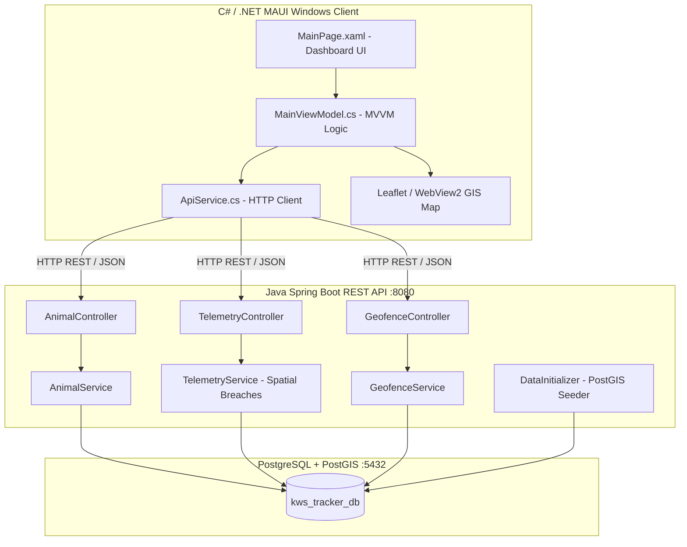

# 🐾 WildGuard Tracker - Kenya Wildlife Service (KWS) Operations Command

[](https://dotnet.microsoft.com/en-us/apps/maui)
[](https://spring.io/projects/spring-boot)
[](https://postgis.net/)
[](https://locationtech.github.io/jts/)

**WildGuard Tracker** is an enterprise spatial monitoring and dispatch dashboard engineered for the **Kenya Wildlife Service (KWS)**. It provides field commanders, dispatchers, and rangers with real-time collar telemetry tracking, PostGIS-powered geofence monitoring, early-warning Human-Wildlife Conflict (HWC) breach alerts, and rapid-response patrol coordination across Kenya's flagship national parks and conservancies.

---

## 🌍 Monitored Kenyan Ecosystems

The platform is purpose-built and calibrated for genuine Kenyan national parks, reserves, and conservancies:

| Sector / Park | Ecosystem & County | Target Species | Key Operational Mission |
| :--- | :--- | :--- | :--- |
| **Amboseli National Park** | Kajiado / Mt. Kilimanjaro Basin | African Elephants (*Loxodonta africana*) | Monitoring herds (*Echo's Matriarch*, *Mutula Bull*) along the southern Kimana community agricultural buffer corridor. |
| **Tsavo East & West National Parks** | Taita-Taveta / Galana River | Red Elephants, Lions (*Panthera leo*) | Vast wilderness tracking (*Galana Red Bull*, *Satao Pride*) across Voi dispersal corridors and SGR crossings. |
| **Maasai Mara National Reserve** | Narok / Mara River Basin | Apex Predators (Lions, Cheetahs) | Mara Predator Project (*Kipsing Male*, *Talek River Female*) and community conservancy boundary monitoring. |
| **Nairobi National Park** | Nairobi / Athi-Kapiti Plains | Eastern Black Rhinos (*Diceros bicornis*) | High-security rhino sanctuary (*Mukurwe Black Rhino*) along the unfenced southern Kitengela dispersal zone. |
| **Ol Pejeta Conservancy** | Laikipia Plateau | Black & Northern White Rhinos | Dedicated anti-poaching security tracking (*Baraka Rhino*) on the high-plateau conservancy. |

---

## ⚡ Key Features

### 1. 🗺️ Interactive GIS Operations Map
- Embedded responsive Leaflet/WebView2 GIS map (zero external API keys required on Windows).
- **PostGIS Vector Geofences:**
  - **Green polygons:** Protected National Parks & Conservancies.
  - **Amber/Dashed polygons:** Community buffer corridors (Kimana, Kitengela).
  - **Red polygons:** High-conflict farmland boundaries.
- **Pulsing Collar Markers:** Animated GPS collar pins color-coded by alert status.
- **Inspect Popups:** Tap any marker to view animal name, species, collar ID, sector, battery level, and real-time status.

### 2. ⚠️ Human-Wildlife Conflict (HWC) Early Warning System
- Real-time spatial point-in-polygon evaluation detecting when collared wildlife breaches protected park perimeters into adjacent agricultural or community land.
- Prominent **Active Incident Alert Banner** with audible/visual urgency indicators.
- **"Dispatch Patrol" Action:** Instantly issues a rapid-response patrol order to the nearest KWS field unit.

### 3. 🏷️ Sector & Species Quick-Filter Strip
- Quick filter chips: `[All Kenya]`, `[Amboseli NP]`, `[Tsavo East NP]`, `[Maasai Mara]`, `[Nairobi NP]`, `[Ol Pejeta]`.
- Synchronously isolates monitored wildlife cards, filters the telemetry log feed, and smoothly zooms and centers the GIS Map directly onto the selected sector.

### 4. 📡 Field Collar Deployment & Wildlife Registry
- Integrated **"+ Add Collar"** modal dialog enabling field rangers and biologists to register new collars directly from the operations dashboard.
- Captures Animal Name, Species, Collar Device ID / IMEI, Sector, and Sex, saving to PostgreSQL via `POST /api/animals` and updating the UI in real time.

### 5. 📊 Live Metrics & Telemetry Feed
- Real-time counts of actively tracked wildlife and satellite GPS fixes captured (100% computed from live data, with zero fake placeholders).
- Scrollable telemetry feed displaying timestamped coordinates (`Lat: {0:F4}°`, `Lng: {0:F4}°`) and collar identifiers.

---

## 🏗️ Technology Stack & Architecture



- **Frontend:**
  - C# 13, **.NET 10 MAUI** targeting Windows (`net10.0-windows10.0.19041.0`).
  - MVVM Architecture with Dependency Injection (`Microsoft.Extensions.DependencyInjection`).
  - Hardware-accelerated `Border` controls with glassmorphism and custom KWS branding palette (`#556B2F`, `#3E4E1C`, `#FFD700`).
  - Typography: **Montserrat** (`MontserratBold`, `MontserratRegular`).
- **Backend:**
  - **Java 21**, **Spring Boot 3.4.x**.
  - **Spring Data JPA** with **Hibernate Spatial**.
  - **JTS Topology Suite** (`org.locationtech.jts`) for native PostGIS geometry processing (`Point`, `Polygon`, `ST_Intersects`).
  - Jackson JTS integration via `org.n52.jackson.datatype.jts.JtsModule`.
  - Spring Security (CSRF disabled for stateless REST endpoints, CORS enabled).
- **Database:**
  - **PostgreSQL 15+** with **PostGIS** extension (`SRID: 4326` WGS 84).

---

## 📁 Repository Directory Structure

```text
KWS/
├── README.md                           # Project Documentation
├── backend/                            # Spring Boot Java Backend
│   ├── build.gradle                    # Gradle Build Configuration
│   ├── gradlew / gradlew.bat           # Gradle Wrappers
│   └── src/main/
│       ├── java/com/kws/backend/backend/
│       │   ├── BackendApplication.java # Main Application Entry Point
│       │   ├── config/
│       │   │   ├── DataInitializer.java# PostGIS Kenya Parks & Wildlife Seeder
│       │   │   ├── SecurityConfig.java # Spring Security Configuration
│       │   │   └── SpatialConfig.java  # Jackson JTS GeoJSON Module Configuration
│       │   ├── controller/
│       │   │   ├── AnimalController.java    # GET/POST /api/animals
│       │   │   ├── GeofenceController.java  # GET/POST /api/geofences
│       │   │   └── TelemetryController.java # GET/POST /api/telemetry
│       │   ├── dto/                    # Data Transfer Objects
│       │   ├── model/                  # JPA Entities (Animal, GeofenceZone, TelemetryLocation)
│       │   ├── repository/             # Spring Data JPA Repositories with PostGIS queries
│       │   └── service/                # Business & Spatial Logic
│       └── resources/
│           └── application.properties  # Database & Hibernate Configuration
└── frontend/                           # .NET MAUI Windows Frontend
    ├── frontend.csproj                 # Project File (.NET 10 MAUI)
    ├── MauiProgram.cs                  # Dependency Injection & Font Registration
    ├── App.xaml / App.xaml.cs          # Global Styles & KWS Palette
    ├── AppShell.xaml                   # Shell Navigation Structure
    ├── MainPage.xaml / MainPage.xaml.cs# Main Spatial Command Dashboard
    ├── models/                         # C# DTOs (AnimalDto, TelemetryLocation, GeofenceDto, IncidentAlertDto)
    ├── Services/
    │   └── ApiService.cs               # Resilient REST API Client with Kenya fallback datasets
    ├── ViewModels/
    │   └── MainViewModel.cs            # Operations State, Filtering, Alerts, Map Generation
    └── Resources/
        ├── Fonts/                      # Montserrat Font Family TTF Assets
        └── Images/                     # KWS Emblem (`kws_logo.jpg`)
```

---

## 🚀 Getting Started

### 1. Prerequisites
- **.NET 10 SDK** with the MAUI workload installed:
  ```powershell
  dotnet workload install maui
  ```
- **Java Development Kit (JDK) 21+**
- **PostgreSQL 15+** with **PostGIS** extension

---

### 2. Database Setup
1. Open your PostgreSQL terminal (psql) or pgAdmin:
   ```sql
   CREATE DATABASE kws_tracker_db;
   \c kws_tracker_db;
   CREATE EXTENSION postgis;
   ```
2. Verify credentials in `backend/src/main/resources/application.properties`:
   ```properties
   spring.datasource.url=jdbc:postgresql://localhost:5432/kws_tracker_db
   spring.datasource.username=postgres
   spring.datasource.password=YourPasswordHere
   spring.jpa.hibernate.ddl-auto=update
   ```

---

### 3. Running the Spring Boot Backend
Open a terminal in the `backend/` directory:
```powershell
cd backend
.\gradlew.bat bootRun
```
*The `DataInitializer` will automatically seed the PostGIS park boundaries (Amboseli, Tsavo, Maasai Mara, Nairobi NP, and Kimana buffer) and collared animals on first boot.*

---

### 4. Running the .NET MAUI Frontend
Open a terminal in the `frontend/` directory:
```powershell
cd frontend
dotnet build -t:Run -f net10.0-windows10.0.19041.0
```
*Alternatively, open `frontend/frontend.slnx` in **Visual Studio 2022/2026** or **Visual Studio Code**, select **Windows Machine**, and press **F5**.*

---

## 📡 REST API Reference

| Method | Endpoint | Description | Sample Request / Payload |
| :--- | :--- | :--- | :--- |
| `GET` | `/api/animals` | Retrieve all registered wildlife | Returns `List<AnimalDto>` |
| `POST` | `/api/animals` | Register a new collared animal | `{"name":"Mara Pride","species":"Lion","collarId":"KWS-MAR-LIO09"}` |
| `GET` | `/api/telemetry` | Retrieve all telemetry fixes | Returns `List<TelemetryLocation>` |
| `POST` | `/api/telemetry` | Ingest new GPS collar ping | `{"collarId":"KWS-AMB-ELE01","latitude":-2.6531,"longitude":37.2625}` |
| `GET` | `/api/geofences` | Retrieve PostGIS park boundaries | Returns `List<GeofenceZone>` with GeoJSON polygon geometry |
| `POST` | `/api/geofences` | Create a new geofence boundary | PostGIS Polygon geometry payload |

---

## 🛡️ License & Acknowledgments
Built for the **Kenya Wildlife Service (KWS)** wildlife conservation operations. Dedicated to field rangers, conservation biologists, and anti-poaching patrol units safeguarding Kenya's natural heritage.
